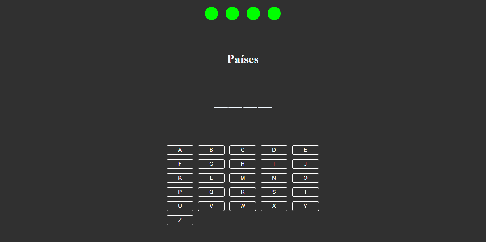

# Desafio_frontend_spacelaxy

## Descrição:
- Projeto simple de um game onde o obijetivo e adivinha a palavra chave ates que suas chances acabem.

- Foi construido em HTML,CSS e JS puro.

- Criei esse projeto para um dessafio de front-end de um server de desenvolvedores no discord

## Instruções de uso:
- Ente no site: [Link do projeto](https://main--wallacegame.netlify.app/) ou então instale localmente em sua maquina

## Instalação do projeto:
1. Faça um fork do projeto.
2. Use o git clone para colnar localmente em sua maquina.
3. Abra o **index.html** em seu navegador ou usse um web server.

